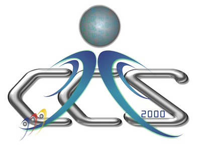
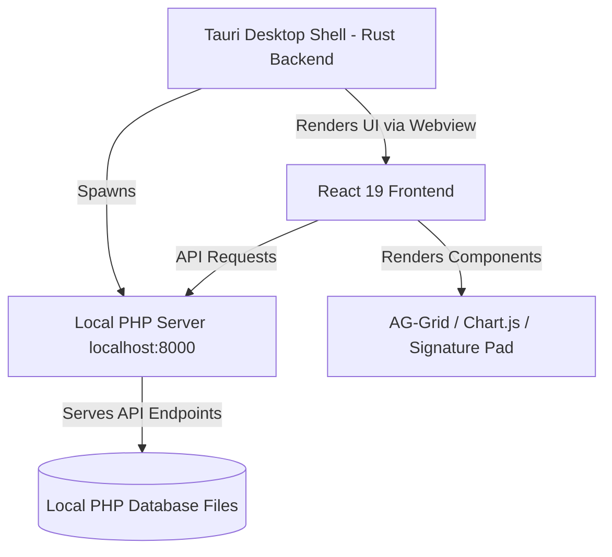

# PLP-FCAS (Pamantasan ng Lungsod ng Pasig - Faculty Consultation and Attendance System)

<p align="center">
  
  
</p>

## Overview & Purpose

The **Faculty Consultation and Attendance System (FCAS)** is a feature-rich, high-performance desktop application custom-built for the **Pamantasan ng Lungsod ng Pasig (PLP)**, specifically powered by the **College of Computer Studies (CCS)**.

The primary goal of this application is to streamline, modernize, and digitalize the logging of student consultations with faculty members. It replaces traditional paper-based logs with a secure desktop environment featuring offline signature logging, real-time analytics, automated data-grid filtering, and unified student-faculty management.

---

## 🚀 Key Features & Functional Portals

The application is structured into three primary user-facing modules:

### 1. Student Portal

- **Numerical Numeric Entry:** Interactive student login using a custom 7-digit student number keypad listener or keyboard input.
- **Account Registration & Recovery:** Multi-step signup flow (`SignUpModal`) and visual recovery portal (`RecoveryModal`) to fetch credentials.
- **Consultation Logging Form (`VisitFormModal`):**
  - Auto-tracks visit timestamps (`Time In` initialized automatically).
  - Auto-selects enrollment status (Regular/Irregular) and student sections.
  - Searchable custom professor selectors.
  - Interactive, offline-capable canvas-based signature board using `signature_pad` with pixel-ratio density mapping to ensure high-fidelity inputs.
- **Submission Acknowledgment:** Beautiful success animation and message modals (`SuccessModal`).

### 2. Faculty Portal (`ProfMyConsultations`)

- **Personal Consultation Logs:** A custom view for the logged-in professor showing their past and current consultations.
- **Interactive Statistics Counters:** Real-time summary tiles showing:
  - **Total Consultations** (total logs).
  - **Total Hours Spent** (calculated from consultation durations).
  - **Total Students Guided** (unique student counter).
- **Advanced Logging Filtering:** Easily filter consultation records by pre-set ranges:
  - _All_
  - _Today_
  - _This Week_
  - _Custom Date Range_ (using date-pickers).
- **Detailed Record Inspector:** Sidebar detail view displaying student information, visit duration in minutes, consultation messages, and student signatures.
- **Export Utilities:** Export consultation logs straight to Excel or CSV.

### 3. Admin Portal (`AdminDashboard`)

- **Analytics Dashboard:** Visual indicators of system statistics (Admins, Professors, Students, Graduates) and interactive charts:
  - **Consultation Reasons (Doughnut Chart):** Breakdowns by categories (e.g., Academic Guidance, Project Assistance, Personal/Emotional Support, College and Career Readiness).
  - **Consultation Over Time (Area Chart):** Trend analysis with bezier-curved filled graphs showing monthly consultation volumes.
- **Student Records Manager (`AdminStudents`):**
  - CRUD interface for managing registered student databases.
  - Interactive data-table powered by **AG-Grid** supporting fast sorting, quick filters, importing from spreadsheets, exporting, and archiving students.
  - Native keyboard shortcuts (e.g., `Ctrl + N` to spawn the student creation modal, `Ctrl + F` to focus the search bar).
- **Consultation Records Manager (`AdminConsultations`):**
  - Master log sheet showing all consultations university-wide.
  - Double-click cell editing with pre-populated selector options (Sections, Professors, Reasons, Statuses).
  - Single-click records deletion and date filtering.

---

## 🛠️ Technical Stack & Architecture



### Frontend

- **Core Framework:** React 19 with TypeScript, compiled using Vite 7.
- **Styling & Theme:** TailwindCSS 4 integrated with customized CSS modules. Standardized fonts loaded dynamically via `@fontsource-variable/geist`.
- **Data Presentation:** **AG-Grid React** themed with customized PLP-green theme parameters.
- **Data Visualization:** **Chart.js** & **React-Chartjs-2** for visual graph generation.
- **UI Primitives:** Accessibility-compliant components built on top of **Radix UI** (Alert Dialog, Dropdown Menu, Dialog, Tooltip, Toast).
- **Device Inputs:** HTML5 Canvas API coupled with `signature_pad` for local graphics rendering.

### Backend & Desktop Container

- **Framework:** **Tauri v2** (Rust-powered application shell).
- **Local Server Engine:** Upon launching, the Rust executable spawns a hidden background PHP server subprocess pointing to the local `/api` directory:
  - Address: `http://localhost:8000`
  - Process command: `C:\xampp\php\php.exe -S localhost:8000 -t ../api`
  - Process lifecycle: Autokills the PHP process when the desktop application window is closed.

---

## 📂 File Directory Map

```bash
plp-fcas/
├── api/                   # PHP API Backend
│   └── test.php           # API connection validator script
├── public/                # Static files directly served by Vite
├── src-tauri/             # Tauri Desktop Rust Code
│   ├── src/
│   │   ├── main.rs        # Tauri entrypoint (spawns PHP Server & boots app)
│   │   └── lib.rs         # Tauri commands library definition
│   ├── Cargo.toml         # Rust backend dependencies manifest
│   └── tauri.conf.json    # Tauri configuration (permissions, windows, icons)
├── src/                   # Frontend React Application Source
│   ├── assets/            # CSS backgrounds, logo graphics, UI loader GIFs
│   ├── components/        # Reusable Page Modals & Utilities
│   │   ├── ui/            # Radix UI primitives (button, table, toast, etc.)
│   │   └── students/      # Admin student CRUD dialogs, toolbar, details panel
│   ├── contexts/          # React contexts (e.g., Toast notifications)
│   ├── hooks/             # Custom utility hooks (e.g., useToast)
│   ├── lib/               # Style merge class tools (utils.ts)
│   ├── pages/             # Route-level page layouts
│   │   ├── MainPage.tsx           # Student login terminal
│   │   ├── ModuleSelection.tsx    # Portal route manager (Admin/Prof/Student)
│   │   ├── AdminDashboard.tsx     # Centralized admin layout & statistics charts
│   │   ├── AdminStudents.tsx      # Student profile data manager
│   │   ├── AdminConsultations.tsx # Master consultation editor grid
│   │   └── ProfMyConsultations.tsx# Personalized faculty log tracker
│   ├── App.tsx            # Main router and root layout
│   └── main.tsx           # Vite entry react-dom renderer
├── package.json           # Node configuration (scripts, npm libraries, plugins)
├── tsconfig.json          # TypeScript workspace settings
└── vite.config.ts         # Vite bundler options & Tauri host parameters
```

---

## ⚙️ Prerequisites & Setup

Ensure the following environments are configured on your machine before running:

1. **Node.js:** v18.0.0 or higher.
2. **Rust Toolchain:** Stable rustup toolchain installer.
3. **C++ Compiler:** Visual Studio Build Tools (ensure C++ workload is checked).
4. **XAMPP/PHP:** Must be installed in the default location (`C:\xampp\php\php.exe`) as Tauri expects the binary path there to serve the API folder.

### Local Development

1. **Clone the repository:**

   ```bash
   git clone <repository-url>
   cd plp-fcas
   ```

2. **Install Node modules:**

   ```bash
   npm install
   ```

3. **Run Tauri Dev Server:**
   ```bash
   npm run tauri dev
   ```
   This bootlegs the local dev environment, automatically starting Vite on port `1420` and mapping the PHP server on port `8000`.

### Production Build

To compile a final release build (creating standard `.exe` installers for Windows):

```bash
npm run tauri build
```

The compiled assets will be bundled into `src-tauri/target/release/bundle/`.

---

## ⌨️ Global Keyboard Shortcuts

| Portal                       | Action                    | Hotkey     |
| :--------------------------- | :------------------------ | :--------- |
| **Admin Portal -> Students** | Add New Student Record    | `Ctrl + N` |
| **Admin Portal -> Students** | Focus Table Search Filter | `Ctrl + F` |
| **Student Visit Form**       | Submit Form Details       | `Enter`    |
